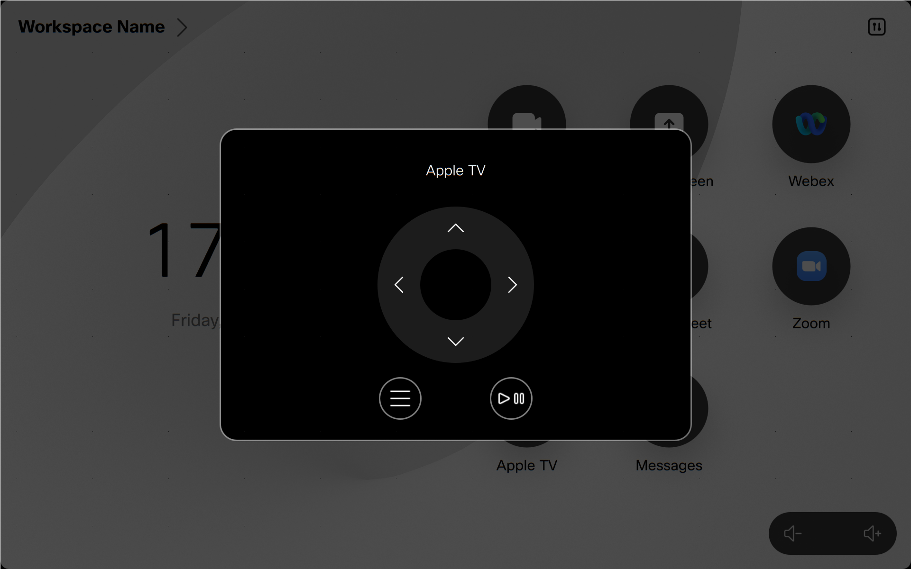

# CEC Control Macro

This is an example macro showing how to control a playback device via HDMI CEC from a Cisco Collaboration Device 

## Overview

The macro creates a basic UI Extension Panel automatically and then listens for the panel to open or close.

Opening and closing the panel will trigger the macro to start or stop a presentation from the configured connector source.

Tapping on the Navigation, Menu or Play/Pause Widgets will trigger the macro to send the appropriate HDMI CEC command to the configured device.

## Setup

### Prerequisites & Dependencies: 

- RoomOS/CE 9.6.x or above Webex Device.
- Web admin access to the device to upload the macro.

### Installation Steps:
1. Download the ``cec-control-macro.js`` file and upload it to your Webex Room devices Macro editor via the web interface.
2. Configure the Macro by changing the initial values, there are comments explaining each one.
3. Enable the Macro on the editor.

## Demo

*For more demos & PoCs like this, check out our [Webex Labs site](https://collabtoolbox.cisco.com/webex-labs).

## License

All contents are licensed under the MIT license. Please see [license](LICENSE) for details.

## Disclaimer

Everything included is for demo and Proof of Concept purposes only. Use of the site is solely at your own risk. This site may contain links to third party content, which we do not warrant, endorse, or assume liability for. These demos are for Cisco Webex use cases, but are not Official Cisco Webex Branded demos.
Please contact the WXSD team at [wxsd@external.cisco.com](mailto:wxsd@external.cisco.com?subject=cec-control-macro) for questions. Or, if you're a Cisco internal employee, reach out to us on the Webex App via our bot (globalexpert@webex.bot). In the "Engagement Type" field, choose the "API/SDK Proof of Concept Integration Development" option to make sure you reach our team. 
